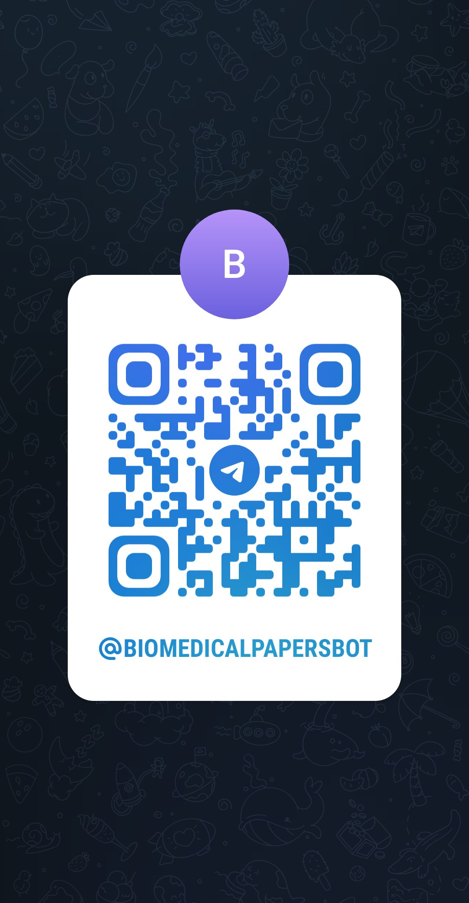

# BioMedicalPapersBot
A Telegram bot to retrieve the title, doi, authors and publication date of papers on PubMed, starting on general search terms or on specific publication names

## How to activate it
Bot is already available at the following link https://t.me/BioMedicalPapersBot or can be activated through the following QR code:

Just click on "Start" on Telegram chat to make it run

## Description
It is a (bio)python-based Telegram bot that searches PubMed and returns the features of the papers that correspond to the search. 
