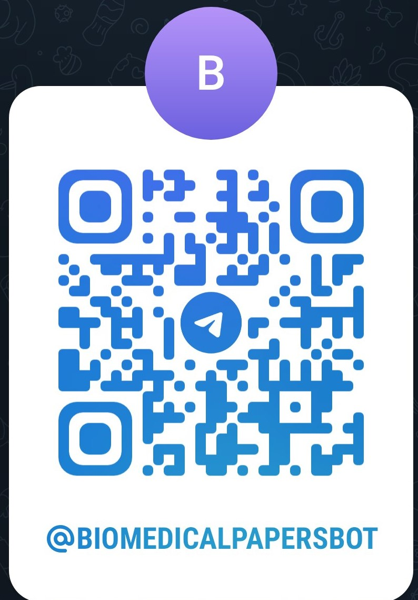

# BioMedicalPapersBot
A Telegram bot to retrieve the title, doi, authors and publication date of papers on PubMed, starting on general search terms or on specific publication names

## How to activate it
Bot is already available at the following link https://t.me/BioMedicalPapersBot or can be activated through the following QR code:

Just click on "Start" on Telegram chat to make it run

## Description
It is a (bio)python-based Telegram bot that searches PubMed and returns the features of the papers that correspond to the search. 

You can find a snippet code of the functions used to retrieve and parse data from PubMed in [module.py](./scripts/module.py). The workflow is pretty simple:

- `search_pubmed` does the actual webscraping, thanks to the Entrez NCBI module, that remotely connects to online servers and communicate with them: the function returns a list of PubMed IDs
- `fetch_pubmed_details`, thanks to a faster access to paper metadata and data with the IDs from the previous function, retrieves significant information about papers and outputs it in standard text format
- `respond_to_query` outputs the information of interest in a format that is human-readable and message-sendable

You can also find the basic architecture of the python code that is used for the telegram bot itself. 

Keep in mind that there are several ways to define a python bot: thus, if you find a faster or better implementation for it, feel free to suggest it in the `ISSUE` section.

## HelpCenter
The author is constantly available to tackle problems you may find while using the bot: use the `ISSUE` section in this page or contact the author directly with contact information provided in the page [/AstraBert/AstraBert](https://github.com/AstraBert/AstraBert)

## License and final consideration
The code is protected by the GNU v.3 license. As the license provider reports: "Permissions of this strong copyleft license are conditioned on making available complete source code of licensed works and modifications, which include larger works using a licensed work, under the same license. Copyright and license notices must be preserved. Contributors provide an express grant of patent rights".

Please note that BioMedicalPapersBot is still experimental and may contain errors or may output not-100%-reliable results, so make sure to always check them.

If you are using BioMedicalPapersBot for you project, please consider to cite the author of this code (Astra Bertelli) and this GitHub repository.
